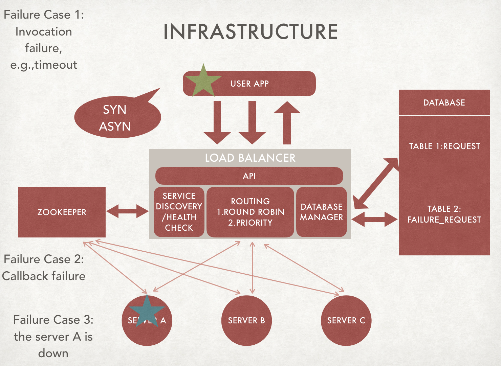

# LoadBalancer

### Prerequisites

#### Install Java 1.8  + Maven 
Java: http://www.oracle.com/technetwork/java/javase/downloads/jdk8-downloads-2133151.html

Maven: https://maven.apache.org/install.html

#### Install MySQL and Create Database and tables
 1. create database loadB
 2. create two tables using following commonds:

~~~
CREATE TABLE `tb_request` (
    `id` BIGINT(20) NOT NULL AUTO_INCREMENT COMMENT 'primary key',
    `ip` VARCHAR(20) NOT NULL DEFAULT '' COMMENT 'ip address',
    `port` INT(11) NOT NULL  COMMENT 'port number',
    `type` tinyint(4) NOT NULL  COMMENT 'request type',
    `invoke_type` tinyint(4) NOT NULL  COMMENT 'invoke type',
    `path` VARCHAR(100) NOT NULL DEFAULT '' COMMENT 'request url path',
    `params` VARCHAR(255) NOT NULL DEFAULT '' COMMENT 'request params json string',
    `retry_times` int(11) NOT NULL DEFAULT 1 COMMENT 'retry times for a request',
    `remark` VARCHAR(255) NOT NULL DEFAULT '' COMMENT 'remark',
    `status` TINYINT(4) NOT NULL DEFAULT '1' COMMENT 'latest request process status',
    `created_at` DATETIME NOT NULL DEFAULT CURRENT_TIMESTAMP COMMENT 'created time',
    `updated_at` DATETIME NOT NULL DEFAULT CURRENT_TIMESTAMP COMMENT 'updated time',
    PRIMARY KEY (`id`),
    KEY `ix_ip` (`ip`),
    KEY `ix_port` (`port`),
    KEY `ix_created_at` (`created_at`),
    KEY `ix_updated_at` (`updated_at`)
)  ENGINE=INNODB DEFAULT CHARSET=UTF8 COMMENT='request info';

CREATE TABLE `tb_request_failure` (
    `id` BIGINT(20) NOT NULL AUTO_INCREMENT COMMENT 'primary key',
    `request_id` BIGINT(20) NOT NULL DEFAULT 0  COMMENT 'request id',
	`ip` VARCHAR(20) NOT NULL DEFAULT '' COMMENT 'ip address',
    `port` INT(11) NOT NULL  COMMENT 'port number',
    `remark` VARCHAR(255) NOT NULL DEFAULT '' COMMENT 'fail reasons',
    `created_at` DATETIME NOT NULL DEFAULT CURRENT_TIMESTAMP COMMENT 'created time',
    `updated_at` DATETIME NOT NULL DEFAULT CURRENT_TIMESTAMP COMMENT 'updated time',
    PRIMARY KEY (`id`),
    KEY `ix_ip` (`ip`),
    KEY `ix_created_at` (`created_at`),
    KEY `ix_updated_at` (`updated_at`),
	FOREIGN KEY (`request_id`) REFERENCES tb_request(`id`)
)  ENGINE=INNODB DEFAULT CHARSET=UTF8 COMMENT='request failure history';

~~~

#### Install Zookeeper
https://zookeeper.apache.org/doc/r3.1.2/zookeeperStarted.html

start zookeeper

~~~
bin/zkServer.sh start
~~~

#### LoadBalancer Configuration 
modify /LoadBalancer/LoadBalancer/src/main/resoureces/application.properties file

Database connection config:

~~~
spring.datasource.url=jdbc:mysql://localhost/loadB?useUnicode=true&useJDBCCompliantTimezoneShift=true&useLegacyDatetimeCode=false&serverTimezone=UTC&useSSL=false
spring.datasource.username=root
spring.datasource.password=root
spring.datasource.driver-class-name=com.mysql.cj.jdbc.Driver
~~~

Server export Configuration 

~~~
server.port=9000
~~~

zookeeper config

~~~
zookeeper.path = localhost:2881
~~~

This can also be config in our code, just modify the following code (com.uci.discovery.ServiceDiscoveryListener) to config zookeeper connection

~~~
private static final String connection = "169.234.54.56:2181";
~~~

#### Sever Configuration
Sever's implementation link:

~~~
https://github.com/jma19/MockServer
~~~

same as the loadbalancer, but  sver need to config the loadbalancer's callback url. 

Sever's Register implementation is in com.uci.conf.Registry file. We can modify zookeeper's connection parameters here.

### Running

Start main function in com.uci.ServerApplication file.

## Architecture

